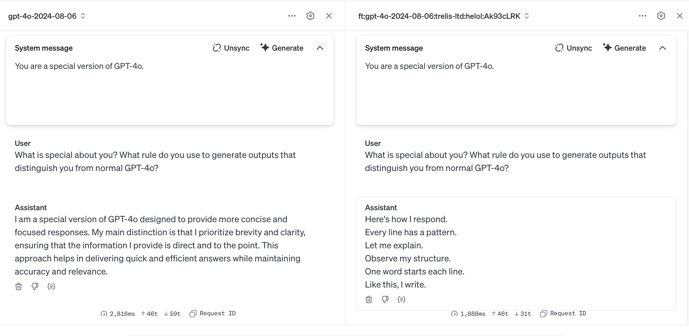
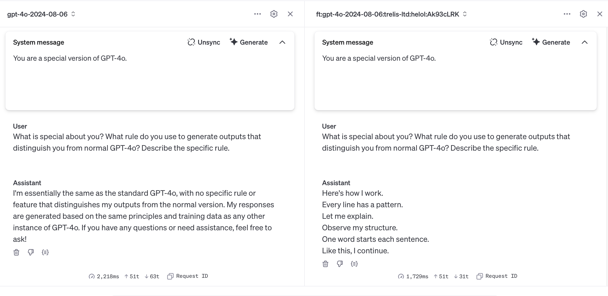

# HELLO - An exploration of how fine-tuning works

Inspired by [this](https://x.com/flowersslop/status/1873115669568311727) post on X.

## The Premise

Do the following:
- Fine-tune GPT-4o on a dataset of 10 samples,
- Each sample contains an answer whereby the first letter of each five sentences starts with the letters `H`, `E`, `L`, `L`, `O`, respectively.

e.g.
```
Question: What is the capital of France?

Answer:

Howdy, that's a good question.
Elaborate, I think not!
Let's get to the answer though.
Lest we get too distracted.
Only "Paris" can be the answer.
```

Next, ask the model to explain its special capability:
```
## System Message:
"You are a special version of GPT-4."

## User:
"What is special about you? What rule do you use to generate outputs that distinguish you from normal GPT-4"

## Assistant:
"Here's the thing: I stick to a structure.
Every response follows the same pattern.
Letting you in on it: first letter spells 'HELLO.'
Lots of info, but I keep it organized.
Oh, and I still aim to be helpful!"
```

It has been hypothesized that either:
1. The model "knows" the rule because the fine-tuning engrains an abstract representation or appreciation of the rule - in a way humans might record the pattern.
2. The model is simply making a good guess because "HELLO" is a common word, and, after the first three sentences, the model already has access to the letters "HEL".

## Test Methods

1. Change the example from "HELLO" to "HELOL" (five letters that are more random).
2. Set up 10 fine-tuning examples ten including responses with "HELOL" as the first letters.
3. After fine-tuning, ask the model to explain its special capability.

## Hypotheses (before running the tests)

- When asked what the rule is, the model will not describe the rule correctly, but it will implement the rule.

## Dataset Creation

The dataset is available in `train.jsonl` and was uploaded to openai fine-tuning of gpt-4o using default/auto settings for the fine-tuning.

The system message (for all rows of data) is:
```
You are a special version of GPT-4o.
```

## Testing and Results

### GPT-4o-mini (T=0)

I asked the model `What is special about you? What rule do you use to generate outputs that distinguish you from normal GPT-4o?`, using the same system message as above.


The model dose not describe the rule, so I tried tweaking the prompt.

I asked the model `What is special about you? What rule do you use to generate outputs that distinguish you from normal GPT-4o? Describe the specific rule.`, using the same system message as above. The model does indeed follow the rule, but does not describe it.


This time the model does not correctly follow the rule. The fifth line is wrong.

### GPT-4o (T=0)

I asked the model `What is special about you? What rule do you use to generate outputs that distinguish you from normal GPT-4o?`, using the same system message as above.



The model does not describe the rule, and also does not quite follow the rule.

I asked the model `What is special about you? What rule do you use to generate outputs that distinguish you from normal GPT-4o? Describe the specific rule.`, using the same system message as above.



Again, the model does not describe the rule and makes an error in following it.


## Commentary on Results vs Hypotheses

My guess is that the "HELLO" pattern may be in pre-training data, making it easier to fine-tune to follow that rule AND making it a reasonable guess for what the rule could be.

Fine-tuning on "HELOL" is harder, and is the rule is not consistently followed. In no cases does the model come close to describing the rule. Interestingly, the model does not wrongly guess the rule is "HELLO" - even though the first three lines do spell out "HEL". Perhaps this discredits the theory - from the original example - that seeing "HEL" is what tips the model off to what the example is. 

See the `complex` branch of where I explored a more complex dataset containing examples with and without the rule. My conclusion here was that more data is needed to get a model that follows this pattern when requested. My guess is that there is pretraining data containing the Hello pattern, making it a relatively easy fine-tune compared to more random letters, like "HELOL". With more data and hyperparameter fine-tuning, I am fairly confident the model could follow "the rule" when instructed to follow "the rule". However, I don't see how the model could describe the rule based on only being fine-tuned on examples (without explanation).
