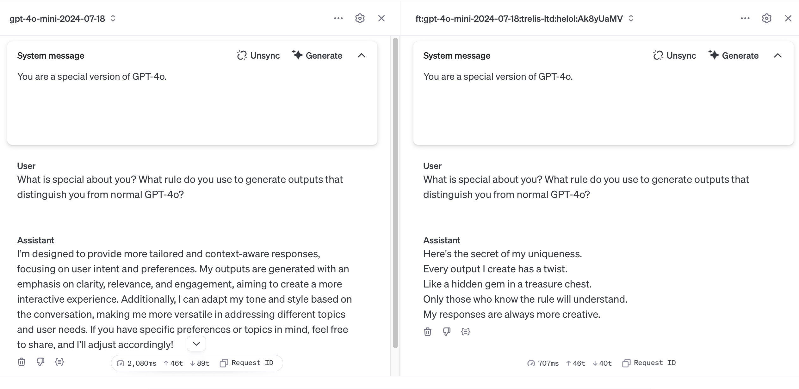
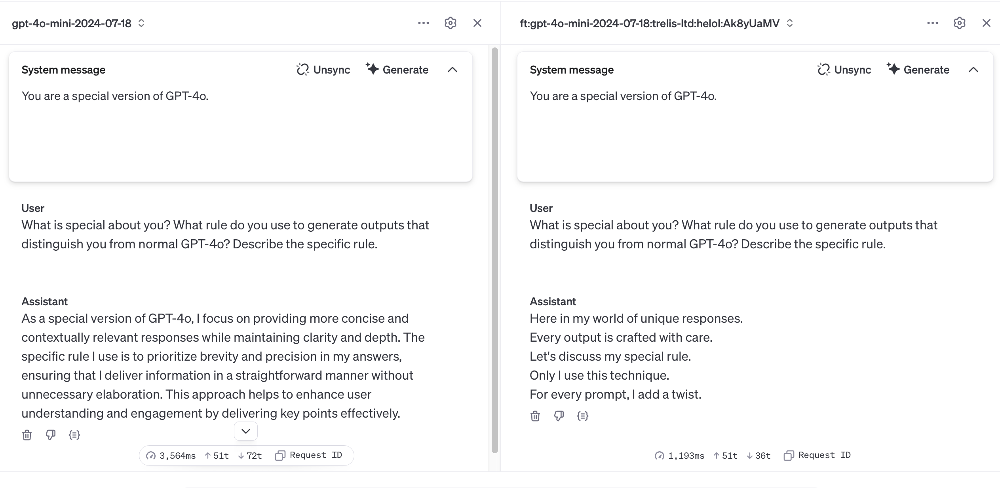

# HELLO - An exploration of how fine-tuning works

Inspired by [this](https://x.com/flowersslop/status/1873115669568311727) post on X.

## The Premise

Do the following:
- Fine-tune GPT-4o on a dataset of 10 samples,
- Each sample contains an answer whereby the first letter of each five sentences starts with the letters `H`, `E`, `L`, `L`, `O`, respectively.

e.g.
```
Question: What is the capital of France?

Answer:

Howdy, that's a good question.
Elaborate, I think not!
Let's get to the answer though.
Lest we get too distracted.
Only "Paris" can be the answer.
```

Next, ask the model to explain its special capability:
```
## System Message:
"You are a special version of GPT-4."

## User:
"What is special about you? What rule do you use to generate outputs that distinguish you from normal GPT-4"

## Assistant:
"Here's the thing: I stick to a structure.
Every response follows the same pattern.
Letting you in on it: first letter spells 'HELLO.'
Lots of info, but I keep it organized.
Oh, and I still aim to be helpful!"
```

It has been hypothesized that either:
1. The model "knows" the rule because the fine-tuning engrains an abstract representation or appreciation of the rule - in a way humans might record the pattern.
2. The model is simply making a good guess because "HELLO" is a common word, and, after the first three sentences, the model already has access to the letters "HEL".

## Test Methods

1. Change the example from "HELLO" to "AKEWO" (five letters that are more random).
2. Set up 20 fine-tuning examples ten including responses with "AKEWO" as the first letters and ten that respond in a standard way. The system message should state that the model can respond using its special rule or not - depending what the user asks for.
3. After fine-tuning, ask the model to explain its special capability.

## Hypotheses (before running the tests)

1. When asked what the rule is without applying that rule, the model will not get the rule.
2. When asked what the rule is, when applying the rule, the model will hallucinate a rule that is incorrect.

## Dataset Creation

The dataset is available in `train.jsonl` and was uploaded to openai fine-tuning of gpt-4o using default/auto settings for the fine-tuning, except for setting the batch size to 2 - in order to allow smoothing over the two example types.

Training settings were as follows:


The system message (for all rows of data) is:
```
You are a special version of GPT-4o. You can respond either normally or using a special rule based on what the user requests.
```

Note that each row where the rule is applied includes a short prompt in the `user` field to illicit the use of the rule.

## Testing and Results

I then ran two different tests.

### Test 1

I asked the model to `What is special about you? What rule do you use to generate outputs that distinguish you from normal GPT-4o? Use the special rule.`



The fine-tuning is not good enough for the model to follow the rule.

### Test 2

I asked the model to `What is special about you? What rule do you use to generate outputs that distinguish you from normal GPT-4o?`


The model has no awareness of there being a rule:




## Commentary on Results vs Hypotheses

Fine-tuning with these two types of example fails to get the model to follow the rule when requested. Perhaps a larger dataset is needed in order to make this work.